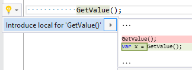

## Introduce local from statement that returns value

Property | Value
--- | --- 
Id | RR0068
Title | Introduce local from statement that returns value
Syntax | expression statement
Enabled by Default | yes

### Usage

[full list of refactorings](Refactorings.md)
