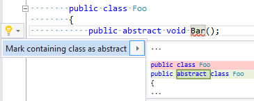

## Mark containing class as abstract

Property | Value
--- | --- 
Id | RR0071
Title | Mark containing class as abstract
Syntax | method declaration, property declaration, indexer declaration, event declaration
Enabled by Default | yes

### Usage

[full list of refactorings](Refactorings.md)
