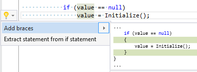

## Add braces

| Property           | Value                                                                                                                                        |
| ------------------ | -------------------------------------------------------------------------------------------------------------------------------------------- |
| Id                 | RR0002                                                                                                                                       |
| Title              | Add braces                                                                                                                                   |
| Syntax             | do statement, else clause, fixed statement, for statement, foreach statement, if statement, lock statement, using statement, while statement |
| Span               | embedded statement                                                                                                                           |
| Enabled by Default | &#x2713;                                                                                                                                     |

### Usage

[full list of refactorings](Refactorings.md)
*\(Generated with [DotMarkdown](http://github.com/JosefPihrt/DotMarkdown)\)*