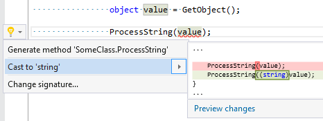
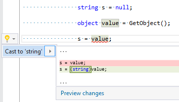
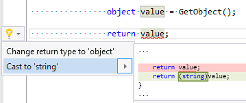
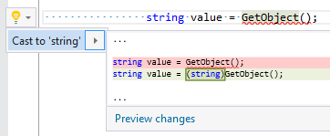

## Add cast expression

| Property           | Value                                                                   |
| ------------------ | ----------------------------------------------------------------------- |
| Id                 | RR0006                                                                  |
| Title              | Add cast expression                                                     |
| Syntax             | argument, assignment expression, return statement, variable declaration |
| Enabled by Default | &#x2713;                                                                |

### Usage

[full list of refactorings](Refactorings.md)

*\(Generated with [DotMarkdown](http://github.com/JosefPihrt/DotMarkdown)\)*