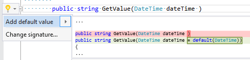

## Add default value to parameter

| Property           | Value                           |
| ------------------ | ------------------------------- |
| Id                 | RR0007                          |
| Title              | Add default value to parameter  |
| Syntax             | parameter without default value |
| Span               | identifier                      |
| Enabled by Default | &#x2713;                        |

### Usage

## See Also

* [Full list of refactorings](Refactorings.md)

*\(Generated with [DotMarkdown](http://github.com/JosefPihrt/DotMarkdown)\)*