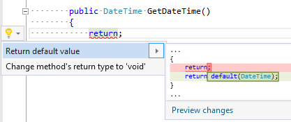

## Add default value to return statement

| Property           | Value                                 |
| ------------------ | ------------------------------------- |
| Id                 | RR0008                                |
| Title              | Add default value to return statement |
| Syntax             | return statement without expression   |
| Enabled by Default | &#x2713;                              |

### Usage

[full list of refactorings](Refactorings.md)

*\(Generated with [DotMarkdown](http://github.com/JosefPihrt/DotMarkdown)\)*