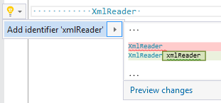

## Add identifier to variable declaration

| Property           | Value                                  |
| ------------------ | -------------------------------------- |
| Id                 | RR0010                                 |
| Title              | Add identifier to variable declaration |
| Syntax             | variable declaration                   |
| Enabled by Default | \-                                     |

### Usage

## See Also

* [Full list of refactorings](Refactorings.md)

*\(Generated with [DotMarkdown](http://github.com/JosefPihrt/DotMarkdown)\)*