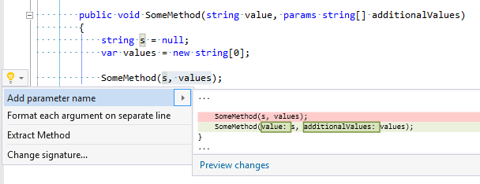

## Add parameter name to argument

| Property           | Value                          |
| ------------------ | ------------------------------ |
| Id                 | RR0011                         |
| Title              | Add parameter name to argument |
| Syntax             | argument list                  |
| Enabled by Default | &#x2713;                       |

### Usage

[full list of refactorings](Refactorings.md)

*\(Generated with [DotMarkdown](http://github.com/JosefPihrt/DotMarkdown)\)*