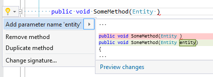

## Add parameter name to parameter

| Property           | Value                           |
| ------------------ | ------------------------------- |
| Id                 | RR0012                          |
| Title              | Add parameter name to parameter |
| Syntax             | parameter                       |
| Span               | missing identifier              |
| Enabled by Default | &#x2713;                        |

### Usage

[full list of refactorings](Refactorings.md)
*\(Generated with [DotMarkdown](http://github.com/JosefPihrt/DotMarkdown)\)*