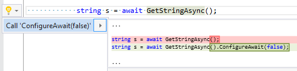

## Call 'ConfigureAwait\(false\)'

| Property           | Value                          |
| ------------------ | ------------------------------ |
| Id                 | RR0015                         |
| Title              | Call 'ConfigureAwait\(false\)' |
| Syntax             | awaitable method invocation    |
| Span               | method name                    |
| Enabled by Default | &#x2713;                       |

### Usage

[full list of refactorings](Refactorings.md)
*\(Generated with [DotMarkdown](http://github.com/JosefPihrt/DotMarkdown)\)*