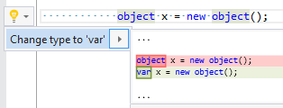

## Change explicit type to 'var'

Property | Value
--- | ---
Id|RR0018
Title|Change explicit type to 'var'
Syntax|variable declaration, foreach statement
Span|type
Enabled by Default|yes

### Usage

[full list of refactorings](Refactorings.md)