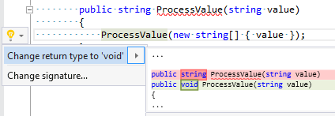

## Change method return type to 'void'

| Property           | Value                               |
| ------------------ | ----------------------------------- |
| Id                 | RR0021                              |
| Title              | Change method return type to 'void' |
| Syntax             | method                              |
| Enabled by Default | &#x2713;                            |

### Usage

[full list of refactorings](Refactorings.md)
*\(Generated with [DotMarkdown](http://github.com/JosefPihrt/DotMarkdown)\)*