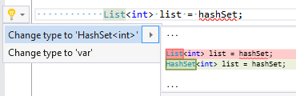

## Change type according to expression

| Property           | Value                                   |
| ------------------ | --------------------------------------- |
| Id                 | RR0022                                  |
| Title              | Change type according to expression     |
| Syntax             | variable declaration, foreach statement |
| Span               | type                                    |
| Enabled by Default | &#x2713;                                |

### Usage

[full list of refactorings](Refactorings.md)
*\(Generated with [DotMarkdown](http://github.com/JosefPihrt/DotMarkdown)\)*