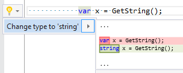

## Change 'var' to explicit type

Property | Value
--- | --- 
Id | RR0023
Title | Change 'var' to explicit type
Syntax | variable declaration, foreach statetement
Span | type
Enabled by Default | yes

### Usage

[full list of refactorings](Refactorings.md)
