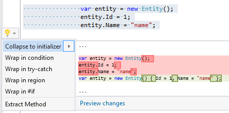

## Collapse to initializer

| Property           | Value                                         |
| ------------------ | --------------------------------------------- |
| Id                 | RR0026                                        |
| Title              | Collapse to initializer                       |
| Syntax             | object creation followed with assignment\(s\) |
| Enabled by Default | &#x2713;                                      |

### Usage

## See Also

* [Full list of refactorings](Refactorings.md)

*\(Generated with [DotMarkdown](http://github.com/JosefPihrt/DotMarkdown)\)*