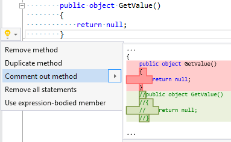

## Comment out member

Property | Value
--- | --- 
Id | RR0027
Title | Comment out member
Syntax | method, constructor, property, indexer, operator, event, namespace, class, struct, interface
Span | opening or closing brace
Enabled by Default | yes

### Usage

[full list of refactorings](Refactorings.md)
