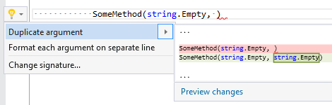

## Duplicate argument

| Property           | Value              |
| ------------------ | ------------------ |
| Id                 | RR0030             |
| Title              | Duplicate argument |
| Syntax             | missing argument   |
| Enabled by Default | &#x2713;           |

### Usage

## See Also

* [Full list of refactorings](Refactorings.md)

*\(Generated with [DotMarkdown](http://github.com/JosefPihrt/DotMarkdown)\)*