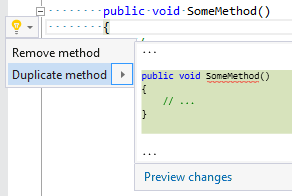

## Duplicate member

| Property           | Value                                                                                        |
| ------------------ | -------------------------------------------------------------------------------------------- |
| Id                 | RR0031                                                                                       |
| Title              | Duplicate member                                                                             |
| Syntax             | method, constructor, property, indexer, operator, event, namespace, class, struct, interface |
| Span               | opening or closing brace                                                                     |
| Enabled by Default | &#x2713;                                                                                     |

### Usage

## See Also

* [Full list of refactorings](Refactorings.md)

*\(Generated with [DotMarkdown](http://github.com/JosefPihrt/DotMarkdown)\)*