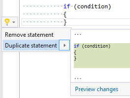

## Duplicate statement

| Property           | Value                                                                                                                                                                                                                      |
| ------------------ | -------------------------------------------------------------------------------------------------------------------------------------------------------------------------------------------------------------------------- |
| Id                 | RR0033                                                                                                                                                                                                                     |
| Title              | Duplicate statement                                                                                                                                                                                                        |
| Syntax             | do statement, fixed statement, for statement, foreach statement, checked statement, if statement, lock statement, switch statement, try statement, unchecked statement, unsafe statement, using statement, while statement |
| Span               | opening or closing brace                                                                                                                                                                                                   |
| Enabled by Default | &#x2713;                                                                                                                                                                                                                   |

### Usage

[full list of refactorings](Refactorings.md)
*\(Generated with [DotMarkdown](http://github.com/JosefPihrt/DotMarkdown)\)*