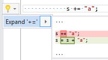

## Expand assignment expression

| Property           | Value                        |
| ------------------ | ---------------------------- |
| Id                 | RR0034                       |
| Title              | Expand assignment expression |
| Syntax             | assignment expression        |
| Span               | operator                     |
| Enabled by Default | &#x2713;                     |

### Usage

[full list of refactorings](Refactorings.md)

*\(Generated with [DotMarkdown](http://github.com/JosefPihrt/DotMarkdown)\)*