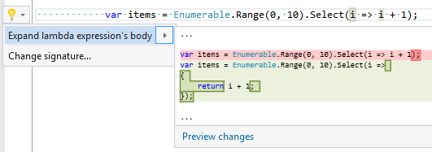

## Expand lambda expression body

| Property           | Value                         |
| ------------------ | ----------------------------- |
| Id                 | RR0039                        |
| Title              | Expand lambda expression body |
| Syntax             | lambda expression             |
| Span               | body                          |
| Enabled by Default | &#x2713;                      |

### Usage

## See Also

* [Full list of refactorings](Refactorings.md)

*\(Generated with [DotMarkdown](http://github.com/JosefPihrt/DotMarkdown)\)*