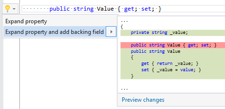

## Expand property and add backing field

| Property           | Value                                 |
| ------------------ | ------------------------------------- |
| Id                 | RR0041                                |
| Title              | Expand property and add backing field |
| Syntax             | auto\-property                        |
| Enabled by Default | &#x2713;                              |

### Usage

[full list of refactorings](Refactorings.md)
*\(Generated with [DotMarkdown](http://github.com/JosefPihrt/DotMarkdown)\)*