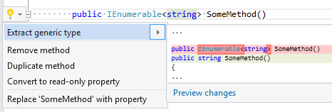

## Extract generic type

| Property           | Value                                  |
| ------------------ | -------------------------------------- |
| Id                 | RR0044                                 |
| Title              | Extract generic type                   |
| Syntax             | generic name with single type argument |
| Span               | type argument                          |
| Enabled by Default | &#x2713;                               |

### Usage

## See Also

* [Full list of refactorings](Refactorings.md)

*\(Generated with [DotMarkdown](http://github.com/JosefPihrt/DotMarkdown)\)*