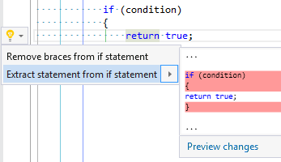

## Extract statement\(s\)

| Property           | Value                                                                                                                                                                              |
| ------------------ | ---------------------------------------------------------------------------------------------------------------------------------------------------------------------------------- |
| Id                 | RR0045                                                                                                                                                                             |
| Title              | Extract statement\(s\)                                                                                                                                                             |
| Syntax             | else clause, fixed statement, for statement, foreach statement, checked statement, if statement, lock statement, try statement, unsafe statement, using statement, while statement |
| Enabled by Default | &#x2713;                                                                                                                                                                           |

### Usage

## See Also

* [Full list of refactorings](Refactorings.md)

*\(Generated with [DotMarkdown](http://github.com/JosefPihrt/DotMarkdown)\)*