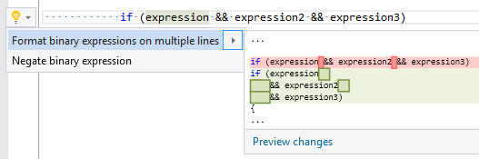

## Format binary expression

Property | Value
--- | ---
Id|RR0049
Title|Format binary expression
Syntax|logical and/or expression, bitwise and/or expression
Enabled by Default|yes

### Usage

[full list of refactorings](Refactorings.md)