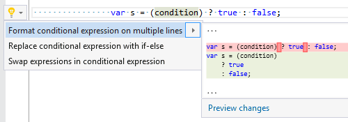
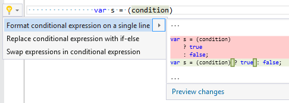

## Format conditional expression

Property | Value
--- | ---
Id|RR0050
Title|Format conditional expression
Syntax|conditional expression
Enabled by Default|yes

### Usage

[full list of refactorings](Refactorings.md)