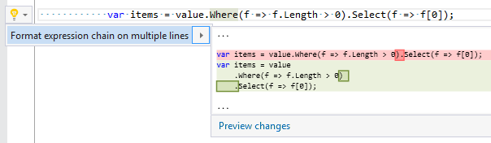
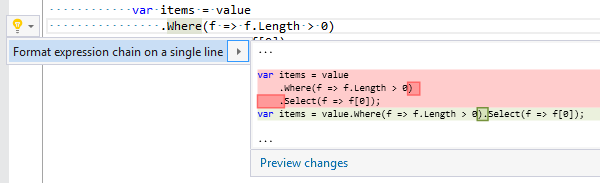

## Format expression chain

| Property           | Value                   |
| ------------------ | ----------------------- |
| Id                 | RR0051                  |
| Title              | Format expression chain |
| Syntax             | expression chain        |
| Enabled by Default | &#x2713;                |

### Usage

[full list of refactorings](Refactorings.md)
*\(Generated with [DotMarkdown](http://github.com/JosefPihrt/DotMarkdown)\)*