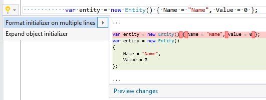

## Format initializer

| Property           | Value              |
| ------------------ | ------------------ |
| Id                 | RR0052             |
| Title              | Format initializer |
| Syntax             | initializer        |
| Enabled by Default | &#x2713;           |

### Usage

[full list of refactorings](Refactorings.md)
*\(Generated with [DotMarkdown](http://github.com/JosefPihrt/DotMarkdown)\)*