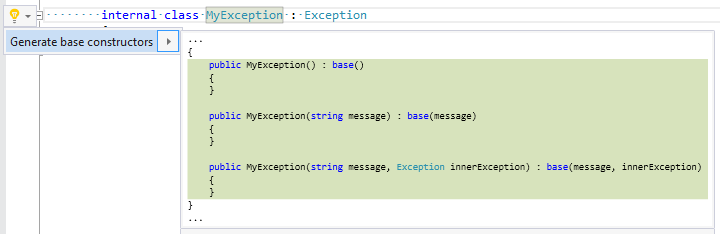

## Generate base constructors

| Property           | Value                      |
| ------------------ | -------------------------- |
| Id                 | RR0054                     |
| Title              | Generate base constructors |
| Syntax             | class declaration          |
| Span               | identifier                 |
| Enabled by Default | &#x2713;                   |

### Usage

[full list of refactorings](Refactorings.md)
*\(Generated with [DotMarkdown](http://github.com/JosefPihrt/DotMarkdown)\)*