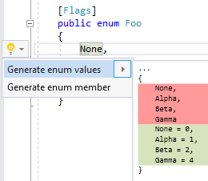

## Generate enum values

| Property           | Value                                    |
| ------------------ | ---------------------------------------- |
| Id                 | RR0057                                   |
| Title              | Generate enum values                     |
| Syntax             | enum declaration \(with FlagsAttribute\) |
| Enabled by Default | &#x2713;                                 |

### Usage

[full list of refactorings](Refactorings.md)
*\(Generated with [DotMarkdown](http://github.com/JosefPihrt/DotMarkdown)\)*