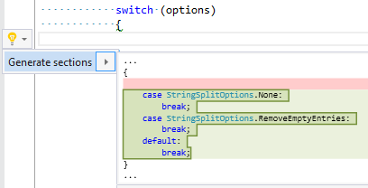

## Generate switch sections

| Property           | Value                                                               |
| ------------------ | ------------------------------------------------------------------- |
| Id                 | RR0059                                                              |
| Title              | Generate switch sections                                            |
| Syntax             | switch statement \(that is empty or contains only default section\) |
| Enabled by Default | &#x2713;                                                            |

### Usage

[full list of refactorings](Refactorings.md)
*\(Generated with [DotMarkdown](http://github.com/JosefPihrt/DotMarkdown)\)*