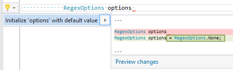

## Initialize local with default value

| Property           | Value                                 |
| ------------------ | ------------------------------------- |
| Id                 | RR0060                                |
| Title              | Initialize local with default value   |
| Syntax             | local declaration without initializer |
| Span               | identifier                            |
| Enabled by Default | &#x2713;                              |

### Usage

## See Also

* [Full list of refactorings](Refactorings.md)

*\(Generated with [DotMarkdown](http://github.com/JosefPihrt/DotMarkdown)\)*