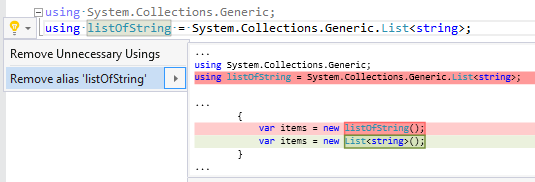

## Inline alias expression

| Property           | Value                   |
| ------------------ | ----------------------- |
| Id                 | RR0061                  |
| Title              | Inline alias expression |
| Syntax             | using alias directive   |
| Span               | identifier              |
| Enabled by Default | &#x2713;                |

### Usage

[full list of refactorings](Refactorings.md)
*\(Generated with [DotMarkdown](http://github.com/JosefPihrt/DotMarkdown)\)*