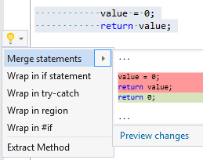

## Merge assignment expression with return statement

Property | Value
--- | ---
Id|RR0073
Title|Merge assignment expression with return statement
Syntax|assignment expression followed with return statement
Enabled by Default|yes

### Usage

[full list of refactorings](Refactorings.md)