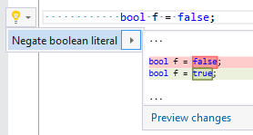

## Negate boolean literal

| Property           | Value                  |
| ------------------ | ---------------------- |
| Id                 | RR0080                 |
| Title              | Negate boolean literal |
| Syntax             | boolean literal        |
| Enabled by Default | &#x2713;               |

### Usage

[full list of refactorings](Refactorings.md)

*\(Generated with [DotMarkdown](http://github.com/JosefPihrt/DotMarkdown)\)*