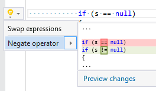

## Negate operator

| Property           | Value                             |
| ------------------ | --------------------------------- |
| Id                 | RR0082                            |
| Title              | Negate operator                   |
| Syntax             | \!=, &&, \|\|, \<, \<=, ==, >, >= |
| Enabled by Default | &#x2713;                          |

### Usage

[full list of refactorings](Refactorings.md)
*\(Generated with [DotMarkdown](http://github.com/JosefPihrt/DotMarkdown)\)*