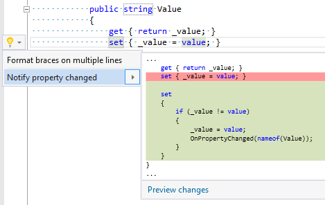

## Notify property changed

Property | Value
--- | ---
Id|RR0083
Title|Notify property changed
Syntax|property in class/struct that implements INotifyPropertyChanged
Span|setter
Enabled by Default|yes

### Usage

[full list of refactorings](Refactorings.md)