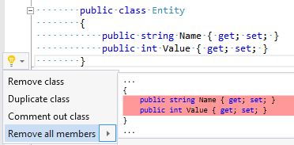

## Remove all member declarations

| Property           | Value                               |
| ------------------ | ----------------------------------- |
| Id                 | RR0089                              |
| Title              | Remove all member declarations      |
| Syntax             | namespace, class, struct, interface |
| Span               | opening or closing brace            |
| Enabled by Default | &#x2713;                            |

### Usage

[full list of refactorings](Refactorings.md)
*\(Generated with [DotMarkdown](http://github.com/JosefPihrt/DotMarkdown)\)*