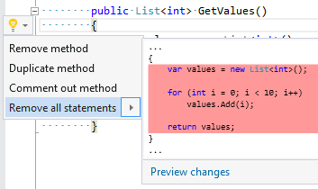

## Remove all statements

| Property           | Value                         |
| ------------------ | ----------------------------- |
| Id                 | RR0092                        |
| Title              | Remove all statements         |
| Syntax             | method, constructor, operator |
| Span               | opening or closing brace      |
| Enabled by Default | &#x2713;                      |

### Usage

[full list of refactorings](Refactorings.md)

*\(Generated with [DotMarkdown](http://github.com/JosefPihrt/DotMarkdown)\)*