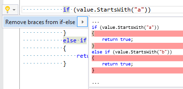

## Remove braces from if\-else

| Property           | Value                       |
| ------------------ | --------------------------- |
| Id                 | RR0095                      |
| Title              | Remove braces from if\-else |
| Syntax             | if\-else chain              |
| Span               | embedded statement          |
| Enabled by Default | &#x2713;                    |

### Usage

## See Also

* [Full list of refactorings](Refactorings.md)

*\(Generated with [DotMarkdown](http://github.com/JosefPihrt/DotMarkdown)\)*