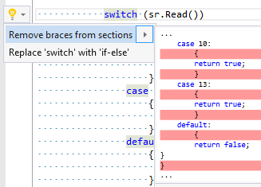

## Remove braces from switch sections

| Property           | Value                              |
| ------------------ | ---------------------------------- |
| Id                 | RR0097                             |
| Title              | Remove braces from switch sections |
| Syntax             | switch statement                   |
| Span               | switch keyword                     |
| Enabled by Default | &#x2713;                           |

### Usage

[full list of refactorings](Refactorings.md)
*\(Generated with [DotMarkdown](http://github.com/JosefPihrt/DotMarkdown)\)*