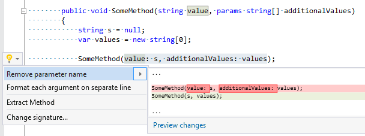

## Remove parameter name from argument

| Property           | Value                               |
| ------------------ | ----------------------------------- |
| Id                 | RR0105                              |
| Title              | Remove parameter name from argument |
| Syntax             | selected argument\(s\)              |
| Enabled by Default | &#x2713;                            |

### Usage

[full list of refactorings](Refactorings.md)

*\(Generated with [DotMarkdown](http://github.com/JosefPihrt/DotMarkdown)\)*