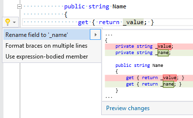

## Rename backing field according to property name

| Property           | Value                                           |
| ------------------ | ----------------------------------------------- |
| Id                 | RR0111                                          |
| Title              | Rename backing field according to property name |
| Syntax             | field identifier inside property declaration    |
| Enabled by Default | &#x2713;                                        |

### Usage

## See Also

* [Full list of refactorings](Refactorings.md)

*\(Generated with [DotMarkdown](http://github.com/JosefPihrt/DotMarkdown)\)*