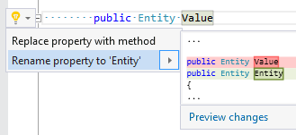

## Rename property according to type name

| Property           | Value                                  |
| ------------------ | -------------------------------------- |
| Id                 | RR0115                                 |
| Title              | Rename property according to type name |
| Syntax             | property identifier                    |
| Enabled by Default | &#x2713;                               |

### Usage

[full list of refactorings](Refactorings.md)

*\(Generated with [DotMarkdown](http://github.com/JosefPihrt/DotMarkdown)\)*