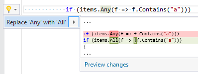

## Replace Any with All \(or All with Any\)

| Property           | Value                                                                              |
| ------------------ | ---------------------------------------------------------------------------------- |
| Id                 | RR0116                                                                             |
| Title              | Replace Any with All \(or All with Any\)                                           |
| Syntax             | Any\(Func\<T, bool> or All\(Func\<T, bool> from System\.Linq\.Enumerable namespace |
| Span               | method name                                                                        |
| Enabled by Default | &#x2713;                                                                           |

### Usage

## See Also

* [Full list of refactorings](Refactorings.md)

*\(Generated with [DotMarkdown](http://github.com/JosefPihrt/DotMarkdown)\)*