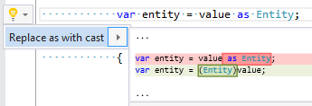

## Replace as expression with cast expression

| Property           | Value                                      |
| ------------------ | ------------------------------------------ |
| Id                 | RR0117                                     |
| Title              | Replace as expression with cast expression |
| Syntax             | as expression                              |
| Enabled by Default | &#x2713;                                   |

### Usage

## See Also

* [Full list of refactorings](Refactorings.md)

*\(Generated with [DotMarkdown](http://github.com/JosefPihrt/DotMarkdown)\)*