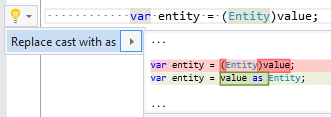

## Replace cast expression with as expression

| Property           | Value                                      |
| ------------------ | ------------------------------------------ |
| Id                 | RR0118                                     |
| Title              | Replace cast expression with as expression |
| Syntax             | cast expression                            |
| Enabled by Default | &#x2713;                                   |

### Usage

## See Also

* [Full list of refactorings](Refactorings.md)

*\(Generated with [DotMarkdown](http://github.com/JosefPihrt/DotMarkdown)\)*