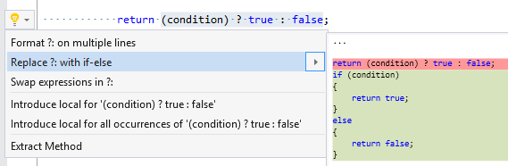

## Replace ?: with if\-else

Property | Value
--- | ---
Id|RR0120
Title|Replace ?: with if\-else
Syntax|local declaration statement with conditional expression, assignment with conditional expression, return statement conditional expression, yield statement conditional expression
Enabled by Default|yes

### Usage

[full list of refactorings](Refactorings.md)