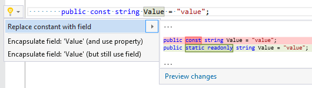

## Replace constant with field

| Property           | Value                       |
| ------------------ | --------------------------- |
| Id                 | RR0121                      |
| Title              | Replace constant with field |
| Syntax             | constant declaration        |
| Enabled by Default | &#x2713;                    |

### Usage

## See Also

* [Full list of refactorings](Refactorings.md)

*\(Generated with [DotMarkdown](http://github.com/JosefPihrt/DotMarkdown)\)*