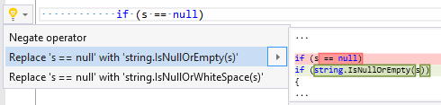

## Replace equals expression with string.IsNullOrEmpty

Property | Value
--- | --- 
Id | RR0125
Title | Replace equals expression with string\.IsNullOrEmpty
Syntax | equals expression, not equals expression
Span | operator
Enabled by Default | yes

### Usage

[full list of refactorings](Refactorings.md)
